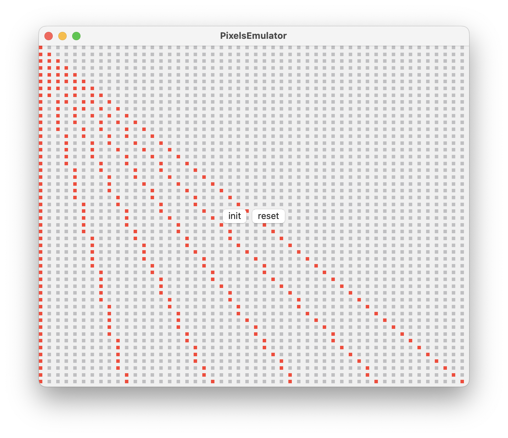

# PixelsEmulator
This is a screen emulator that displays a 2-D matrix of circles with variable optional params(color, radius etc.) and I call it a pixel emulator. Its so-called pixels are presented by built-in shape view 'Rectangle' or other any shapes, so you can imagine how trash it is. However, I'm just a beginner of Computer Graphics, and it's insane that the tutor is still using Windows XP as lab evm in class! I'll try to do all assignments using my own emulator. IKR.

